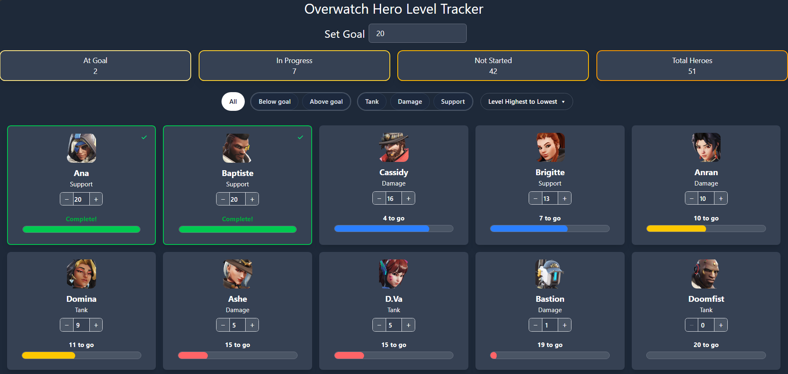

A personal hero progression tracker for Overwatch's Progression 2.0 system. Set a target level, log your progress across all 51 heroes, and instantly see who still needs work — all from a clean, responsive interface.



🚀 **[Live Demo](https://overwatch-hero-level-tracker.vercel.app)**

## Features

- **Goal setting** — set a target level and track all 51 heroes against it in real time
- **Hero grid** — portrait, role, current level, and a colour-coded progress bar for every hero
- **Completion indicator** — green border and checkmark on completed cards, with a brief bounce animation on reaching your goal
- **Filtering** — filter by status (below goal / above goal) and role (tank, damage, support), combinable
- **Sorting** — sort alphabetically (A–Z or Z–A) or by level (highest or lowest first)
- **Summary bar** — at-a-glance count of heroes at goal, in progress, and not started
- **Persistent data** — goal and all hero levels are saved to localStorage and survive page refreshes

## Tech Stack

| Layer            | Technology                          |
| ---------------- | ----------------------------------- |
| Framework        | Vue 3 (Composition API)             |
| Language         | TypeScript                          |
| State management | Pinia + pinia-plugin-persistedstate |
| Styling          | Tailwind CSS v4                     |
| Utilities        | VueUse                              |
| Testing          | Vitest + Vue Test Utils             |
| Build tool       | Vite                                |
| Deployment       | Vercel                              |

## Getting Started

### Prerequisites

- Node.js (v18 or higher recommended)
- npm

### Installation

```bash
# Clone the repository
git clone https://github.com/Robert-Pavaloiu/ow-hero-tracker.git

# Navigate into the project
cd ow-hero-tracker

# Install dependencies
npm install

# Start the development server
npm run dev
```

The app will be running at `http://localhost:5173`

### Running tests

```bash
npm run test:unit
```

### Building for production

```bash
npm run build
```

## Project Structure

```
src/
├── __tests__/          # Vitest unit tests
├── assets/             # Global CSS
├── components/
│   ├── goal-form.vue             # Goal level input
│   ├── grid-filters.vue          # Status and role filter buttons
│   ├── grid-sort-by.vue          # Sort order selector
│   ├── hero-card.vue             # Individual hero card with completion animation
│   ├── hero-grid.vue             # Responsive hero card grid
│   ├── hero-level-stepper.vue    # Level − / + input control
│   ├── hero-progress-bar.vue     # Colour-coded progress bar
│   ├── sort-dropdown.vue         # Custom pill-style dropdown
│   └── summary-bar.vue           # At goal / in progress / not started counts
├── data/
│   └── heroes.json     # Static hero data (id, name, role, portrait URL)
├── stores/
│   └── globals-store.ts  # Pinia store — progress, filters, sorting, computed stats
├── types.ts            # Shared TypeScript types
├── App.vue
└── main.ts
```

## Data Persistence

This app has no backend. All data is persisted locally in the browser using `localStorage` via `pinia-plugin-persistedstate`. Data will persist indefinitely across sessions until browser storage is manually cleared. As a result, data is browser and device specific and will not sync across devices.

Blizzard does not provide a public API for individual player hero progression levels, so levels are entered manually using the stepper on each card.

## What's Built

All core features are complete and functional:

- Hero grid with real Blizzard CDN portraits across all 51 heroes
- Manual level tracking with − / + stepper and direct input
- Combinable filters by status and role
- Completion state with visual indicator and card animation
- Fully persistent progress via localStorage
